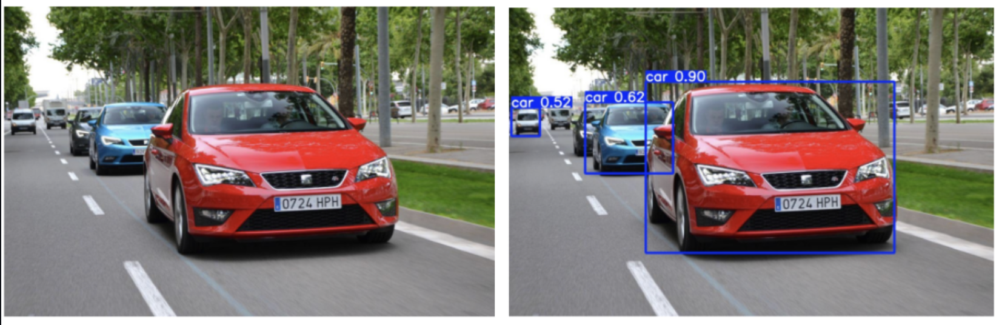
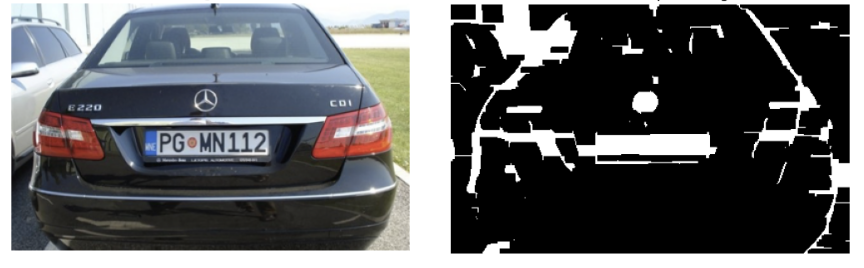
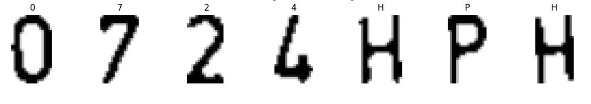
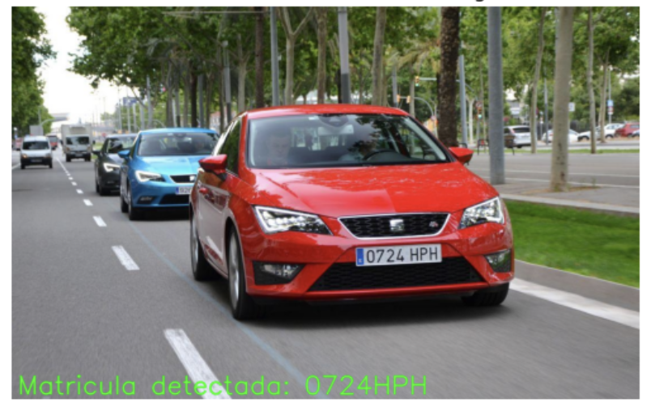

# Automatic Number Plate Recognition System (ANPR)

This repository contains the development of an automatic license plate recognition system for vehicles parked on public roads. The project combines classical image processing methodologies with advanced neural networks (Deep Learning).

This project was developed at the **Computer Vision subject** at the **Universitat Autònoma de Barcelona (UAB)**, designed to be integrated into a mobile robot for patrolling parking areas.

---

### *PROJECT OBJECTIVE*
The main objective is to implement a solution capable of accurately identifying the license plates of parked cars using Computer Vision. This tool provides an efficient and scalable solution for automated parking space management.

### *MODELS & PERFORMANCE OVERVIEW*

Below is a summary of the models and techniques used in each phase of the project, along with their respective architectures and performance metrics:

| Phase / Model | Purpose | Technologies & Architecture | Performance Metrics |
| :--- | :--- | :--- | :--- |
| **YOLOv8** | Vehicle Detection | Real-time object detection (Trained with 15 epochs, batch size 8) | **87.9%** Precision, **85.7%** Recall |
| **Classical CV** | Plate Localization | Grayscale, CLAHE, Gamma correction, Bilateral filter, Sobel filter, Morphological Closing | **80%** Accuracy (15px mean error) |
| **Custom CNN** | Character Recognition (OCR) | Conv2D, MaxPooling, Flatten, Dense ReLU, Dropout, Softmax (Adam optimizer, 20 epochs) | **99%** Accuracy |
| **End-to-End Pipeline** | Global System Evaluation | Integration of YOLOv8 + Classical CV + OCR on a custom dataset | **85%** Overall Accuracy |

### *SYSTEM ARCHITECTURE PIPELINE*
The system is built upon three consecutive stages to ensure maximum accuracy:

**VEHICLE DETECTION**
- Utilizes the **YOLOv8** (You Only Look Once) model, widely recognized for its real-time object detection capabilities.
- Identifies vehicles and their position (Bounding-Boxes) within each image frame.

  

**LICENSE PLATE LOCALIZATION**
- Once the car is detected, classical image processing techniques are applied:
  - Grayscale conversion and **CLAHE** equalization to highlight details.
  - Gamma correction and bilateral filtering to remove noise.
  - **Sobel** filter (horizontal direction) and morphological operations (*closing*) to detect edges and extract the rectangular contour of the license plate.

  

**OPTICAL CHARACTER RECOGNITION (OCR)**
- A hybrid system was developed, segmenting each character using a Gaussian filter and Otsu's binarization.
- Implements a **Convolutional Neural Network (CNN)** trained on the *Chars74k* dataset, expanded with characters from Spanish license plates.

  

---

### *CONCLUSION*

The combination of classical computer vision techniques with Deep Learning models (YOLOv8 + CNN) provides a robust and efficient solution. It successfully overcomes perspective challenges and guarantees a high success rate in automatic license plate recognition in real-world scenarios.

  

